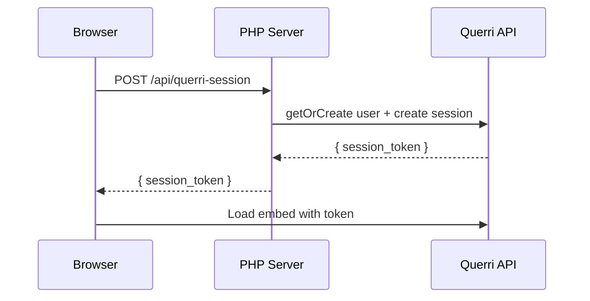

# querri/embed — PHP SDK

> Embed Querri analytics in your PHP application. One method call, zero config.

**Laravel** | **Symfony** | **Plain PHP** | **WordPress**

PHP SDK for creating embed sessions, managing users, and controlling access policies via the Querri API. Use it with any PHP framework alongside the [`@querri-inc/embed`](https://www.npmjs.com/package/@querri-inc/embed) frontend component. One `getSession()` call, one server endpoint, and you're done.

## Get Started in 60 Seconds

### 1. Install

```bash
composer require querri/embed
```

### 2. Create a session

```php
use Querri\Embed\QuerriClient;

$client = new QuerriClient('qk_your_api_key');

$session = $client->getSession([
    'user' => 'customer-42',  // external ID from your system
    'ttl'  => 3600,
]);

echo $session->sessionToken;  // JWT to pass to the frontend
```

### 3. Add the embed (React)

```tsx
import { QuerriEmbed } from '@querri-inc/embed/react';

<QuerriEmbed
  style={{ width: '100%', height: '600px' }}
  serverUrl="https://app.querri.com"
  auth={{ sessionEndpoint: '/api/querri-session' }}
/>
```

### 4. Wire the endpoint

```php
// public/api/querri-session.php (or your framework's route handler)
$client = new QuerriClient();  // reads QUERRI_API_KEY from env
$session = $client->getSession([
    'user' => ['external_id' => $authUser->id, 'email' => $authUser->email],
    'ttl'  => 3600,
]);
header('Content-Type: application/json');
echo json_encode($session);
```

Set `QUERRI_API_KEY` and `QUERRI_ORG_ID` [environment variables](#configuration). In production, always derive user identity from your auth system — never from the request body.

### 5. Done.

The embed handles auth, token caching, and cleanup automatically.



> **Security:** Always derive user identity and access from your server-side auth system. Never read `user` or `access` from the request body — a malicious client can impersonate any user or escalate access.

## Configuration

The SDK reads configuration from constructor arguments or environment variables:

| Parameter | Env Variable | Default | Description |
|-----------|-------------|---------|-------------|
| `api_key` | `QUERRI_API_KEY` | _(required)_ | Your Querri API key (`qk_...`) |
| `org_id` | `QUERRI_ORG_ID` | `null` | Organization ID |
| `host` | `QUERRI_URL` | `https://app.querri.com` | Querri API host |
| `timeout` | — | `30.0` | Request timeout in seconds |
| `max_retries` | — | `3` | Max retries on 429/5xx errors |

```php
// Read from environment variables
$client = new QuerriClient();

// API key string shorthand
$client = new QuerriClient('qk_...');

// Full config array
$client = new QuerriClient([
    'api_key'     => 'qk_...',
    'org_id'      => 'org_...',
    'host'        => 'https://app.querri.com',
    'timeout'     => 30.0,
    'max_retries' => 3,
]);
```

## `getSession()` — Embed Sessions

The flagship method that creates an embed session in three steps:

1. **User resolution** — creates or retrieves a Querri user by your external ID
2. **Access policy** — auto-creates or reuses a deterministic policy with row-level filters
3. **Session creation** — generates a JWT token for the embed iframe

### With inline access rules

```php
$session = $client->getSession([
    'user' => [
        'external_id' => 'customer-42',
        'email'       => 'alice@acme.com',
        'first_name'  => 'Alice',
    ],
    'access' => [
        'sources' => ['src_sales_data'],
        'filters' => [
            'tenant_id' => 'acme',
            'region'    => ['us-east', 'us-west'],
        ],
    ],
    'origin' => 'https://app.acme.com',
    'ttl'    => 7200,
]);
```

### With pre-created policy IDs

```php
$session = $client->getSession([
    'user'   => ['external_id' => 'customer-42'],
    'access' => ['policy_ids' => ['pol_abc123', 'pol_def456']],
]);
```

### GetSessionResult

```php
$session->sessionToken;  // string — JWT for the embed
$session->expiresIn;     // int — seconds until expiry
$session->userId;        // string — Querri user ID
$session->externalId;    // string|null — your external ID

// JSON-serializable for API responses
echo json_encode($session);
// {"session_token":"...","expires_in":3600,"user_id":"...","external_id":"..."}
```

## Direct Resource Usage

For advanced use cases, access the API resources directly:

### Users

```php
$user = $client->users->getOrCreate('ext-123', [
    'email' => 'user@example.com',
    'role'  => 'member',
]);

$user = $client->users->retrieve('usr_abc123');
$users = $client->users->list(['limit' => 50]);
$client->users->update('usr_abc123', ['first_name' => 'Alice']);
$client->users->del('usr_abc123');
```

### Policies

```php
$policy = $client->policies->create([
    'name'        => 'APAC Sales',
    'source_ids'  => ['src_1'],
    'row_filters' => [
        ['column' => 'region', 'values' => ['APAC']],
    ],
]);

$client->policies->assignUsers($policy['id'], ['usr_abc123']);
$client->policies->removeUser($policy['id'], 'usr_abc123');
```

### Embed Sessions

```php
$session = $client->embed->createSession([
    'user_id' => 'usr_abc123',
    'ttl'     => 3600,
]);

$refreshed = $client->embed->refreshSession($session['session_token']);
$client->embed->revokeSession('ses_abc123');
```

## Error Handling

All errors extend `QuerriException`. API errors are mapped to specific exception types:

```
QuerriException
├── ConfigException          — missing/invalid configuration
├── ConnectionException      — network failures (auto-retried)
│   └── TimeoutException     — request timeout exceeded
└── ApiException             — HTTP error responses
    ├── AuthenticationException — 401
    ├── RateLimitException   — 429 (auto-retried)
    ├── NotFoundException    — 404
    └── ServerException      — 5xx (auto-retried)
```

```php
use Querri\Embed\Exceptions\ApiException;
use Querri\Embed\Exceptions\AuthenticationException;
use Querri\Embed\Exceptions\RateLimitException;
use Querri\Embed\Exceptions\ConfigException;

try {
    $session = $client->getSession([...]);
} catch (AuthenticationException $e) {
    // 401 — invalid API key
    echo "Auth failed: {$e->getMessage()}";
} catch (RateLimitException $e) {
    // 429 — rate limited (auto-retried up to maxRetries)
    echo "Rate limited, retry after: {$e->retryAfter}s";
} catch (ApiException $e) {
    // Any other API error
    echo "API error {$e->status}: {$e->getMessage()}";
    echo "Request ID: {$e->requestId}";
} catch (ConfigException $e) {
    // Missing API key or invalid config
    echo $e->getMessage();
}
```

The SDK automatically retries **429** (always) and **5xx** (idempotent methods only) with exponential backoff + jitter, up to `max_retries` attempts.

## Example App

See [`examples/react-embed/`](examples/react-embed/) for a complete working example with a PHP backend and React frontend.

## Full Reference

See **[docs/server-sdk.md](docs/server-sdk.md)** for the complete API reference, including every method signature, framework integration guides (Laravel, Symfony), error handling details, and the `getSession()` deep dive.

## Troubleshooting

### "API key is required" error

Set the `QUERRI_API_KEY` environment variable. Find your API key at [app.querri.com/settings/api-keys](https://app.querri.com/settings/api-keys).

```bash
# .env or your server config
QUERRI_API_KEY=qk_your_api_key
QUERRI_ORG_ID=org_your_org_id
```

The SDK checks `getenv()`, `$_ENV`, and `$_SERVER` — covering CLI, Apache, nginx+FPM, and Docker.

### Embed is blank / session endpoint returns 500

Verify your PHP endpoint returns JSON with the correct `Content-Type`:

```php
header('Content-Type: application/json');
echo json_encode($session);  // GetSessionResult is JsonSerializable
```

### CORS errors in development

Use Vite's dev proxy to forward `/api` requests to your PHP server — no CORS headers needed:

```typescript
// vite.config.ts
server: { proxy: { '/api': 'http://localhost:8080' } }
```

### Class not found errors

Ensure Composer's autoloader is loaded before using SDK classes:

```php
require_once __DIR__ . '/vendor/autoload.php';
```

## Important Notes

- This SDK uses the **Server Token** auth mode. Your PHP backend creates session tokens and the frontend embed consumes them. For other auth modes (Share Key, Popup Login), see the [JS SDK docs](https://www.npmjs.com/package/@querri-inc/embed).
- **React/Vue/Angular:** Memoize the `auth` prop if it's an object. A new object reference on every render cycle causes the iframe to be destroyed and recreated.
- The PHP SDK focuses on the embed use case (Users, Embed, Policies). For additional resources (Projects, Dashboards, Chats, etc.), use the [JS SDK](https://www.npmjs.com/package/@querri-inc/embed) or the [HTTP API directly](https://app.querri.com/docs/api).

## Requirements

- PHP 8.4+
- `ext-json`
- `ext-hash`
- [`symfony/http-client`](https://symfony.com/doc/current/http_client.html) ^7.2

## License

MIT
